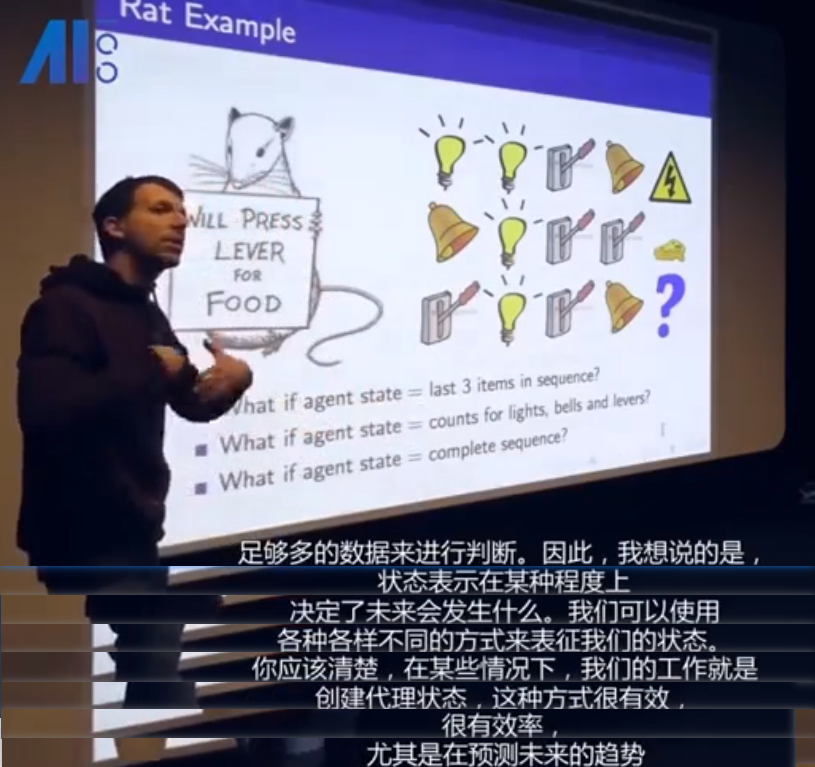
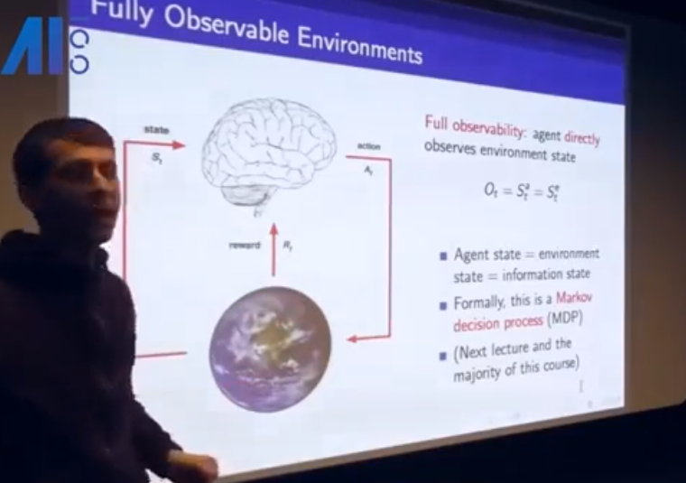
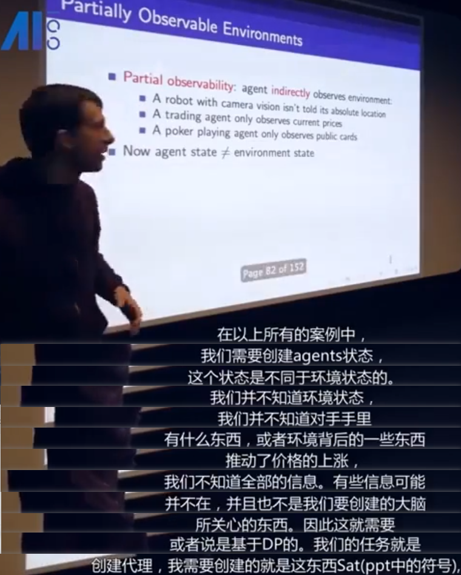
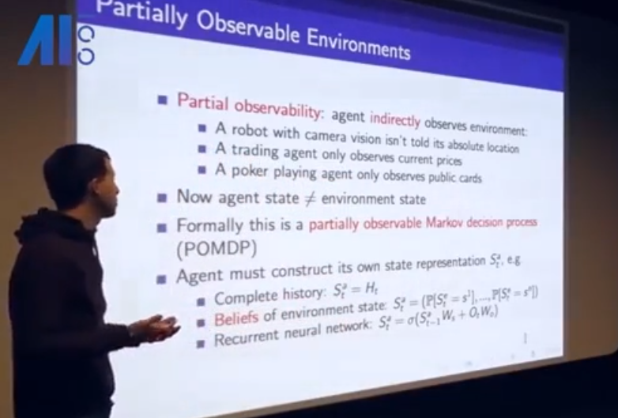
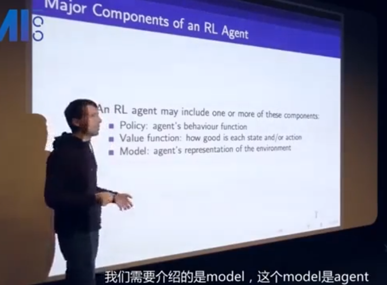
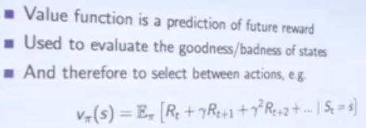
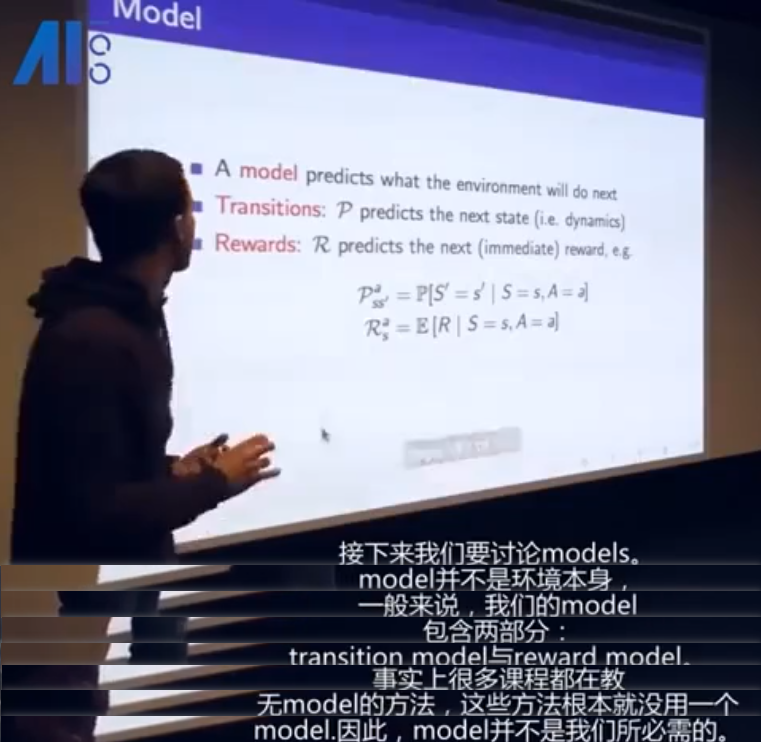
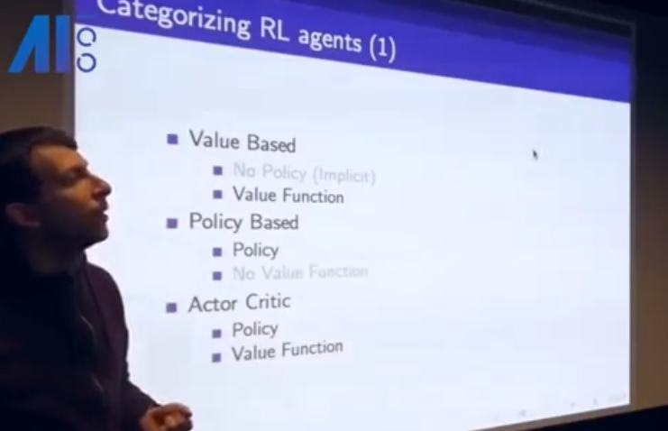
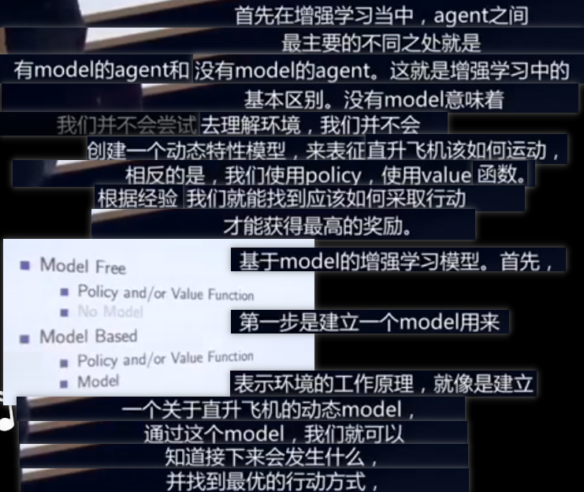
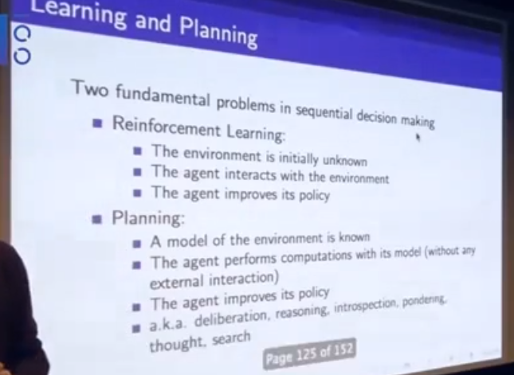

# RL Course by David Silver
## note on lecture1
课程主页：http://www0.cs.ucl.ac.uk/staff/D.Silver/web/Teaching.html

如何定义 agent 状态，很重要

环境完全可见

环境不完全可见

agent 的三个主要组成部件

value function:

model: a model is how the agent think the  environment

对 aagent 分类

* value based. 如果 agent 只包含 value function，policy 不明显，是通过 value function 来确定的(比如迷宫问题)

Learning and Planning

One way to to in RL is to first learning how the environment work, and then, to planning.
所以这两个问题不是分开的，是紧密联系在一起的。

Exploration and Exploitation
* Exploration finds more information about the environment
* Exploitation exploits known information to maximise reward
* It is usually important to explore as well as exploit

Prediction and Control
* Prediction: evaluate the future
  * Given a policy
* Control: optimise the future
  * Find the best policy

prediction 相当于，"一直向前走会有多大收益"
contronl 相当于，"向哪个方向走才有最大收益"
需要通过解决 prediction 进而解决 contronl

